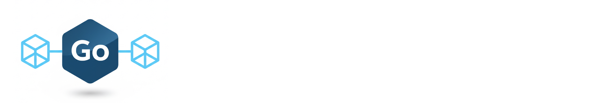
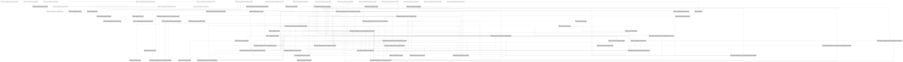

# 

## Table of contents

- [Summary](#summary)
- [Development](#development)
- [Packages](#packages)
- [Dependencies](#dependencies)
  - [Graph](#graph)
  - [Licenses](#licenses)
- [License](#license)

## Summary

Go shared library.

## Development

To work with the codebase, use `make` command as the primary entry point for all project tools.

Use the arrow keys `↓ ↑ → ←` to navigate the options, and press `/` to toggle search.

## Packages

- [`container`](pkg/container/README.md) - A simple service container.
- [`dsn`](pkg/dsn/README.md) - A lightweight, scheme-aware parser that normalizes **DSN** strings from **URLs** and file
  paths into a structured form.
- [`env`](pkg/env/README.md) - This package provides a generic, type-safe wrapper around
  [`go-envconfig`](https://github.com/sethvargo/go-envconfig) for loading environment variables into strongly-typed Go
  structs. It exposes two factory functions: `NewEnv[T]()` for error-handled config loading, and `MustBuildEnv[T]()` for
  startup-time initialization that panics on misconfiguration.
- [`fsm`](pkg/fsm/README.md) - This package contains a simple **Finite State Machine** package.
- [`http`](pkg/http/README.md) - This package contains **HTTP** specific components.
- [`json`](pkg/json/README.md) - This package provides generic, type-safe utilities for unmarshalling raw JSON into
  typed Go structs, along with testing helpers for managing deterministic sequences of JSON values and a simple
  serialiser with capability to serialise for specific group of interest.
- [`logger`](pkg/logger/README.md) - This package provides a simple asynchronous logger that processes log entries
  through a buffered channel and a background worker. It supports multiple log levels (`debug`, `info`, `warn`, `error`,
  `fatal`) and both `text` and `json` output formats, with structured fields for contextual metadata.
- [`mongo`](pkg/mongo/README.md) - Package mongo provides a mongo client factory and abstractions for interacting with
  mongo. It wraps the official mongo Go driver, exposing a simplified interface for connection management and database
  operations.
- [`strings`](pkg/strings/README.md) - This package provides string manipulation utilities.
- [`sync`](pkg/sync/README.md) - This package provides concurrency primitives and thread-safe data structures to
  complement the Go standard library.
- [`time`](pkg/time/README.md) - This package provides time utilities, currently offering a replaceable time provider to
  simplify time-dependent logic in tests.
- [`transform`](pkg/transform/README.md) - Package transform provides utilities for data transformation and type
  conversion.
- [`validator`](pkg/validator/README.md) - This package provides JSON schema-based validation for **JSON**, **YAML**,
  and arbitrary Go values.

## Dependencies

### Graph

### Licenses

| Package                                            | Licence                                                                             | Type         |
|----------------------------------------------------|-------------------------------------------------------------------------------------|--------------|
| github.com/danielgtaylor/huma/v2                   | https://github.com/danielgtaylor/huma/blob/v2.39.0/LICENSE.md                       | MIT          |
| github.com/go-chi/chi/v5                           | https://github.com/go-chi/chi/blob/v5.3.1/LICENSE                                   | MIT          |
| github.com/golang-jwt/jwt/v4                       | https://github.com/golang-jwt/jwt/blob/v4.5.2/LICENSE                               | MIT          |
| github.com/google/uuid                             | https://github.com/google/uuid/blob/v1.6.0/LICENSE                                  | BSD-3-Clause |
| github.com/hashicorp/go-version                    | https://github.com/hashicorp/go-version/blob/v1.7.0/LICENSE                         | MPL-2.0      |
| github.com/iancoleman/strcase                      | https://github.com/iancoleman/strcase/blob/v0.3.0/LICENSE                           | MIT          |
| github.com/klauspost/compress                      | https://github.com/klauspost/compress/blob/v1.18.6/LICENSE                          | MIT          |
| github.com/klauspost/compress/internal/snapref     | https://github.com/klauspost/compress/blob/v1.18.6/internal/snapref/LICENSE         | BSD-3-Clause |
| github.com/klauspost/compress/s2                   | https://github.com/klauspost/compress/blob/v1.18.6/s2/LICENSE                       | BSD-3-Clause |
| github.com/klauspost/compress/snappy               | https://github.com/klauspost/compress/blob/v1.18.6/snappy/LICENSE                   | BSD-3-Clause |
| github.com/klauspost/compress/zstd/internal/xxhash | https://github.com/klauspost/compress/blob/v1.18.6/zstd/internal/xxhash/LICENSE.txt | MIT          |
| github.com/liip/sheriff/v2                         | https://github.com/liip/sheriff/blob/v2.0.1/LICENSE                                 | BSD-3-Clause |
| github.com/sethvargo/go-envconfig                  | https://github.com/sethvargo/go-envconfig/blob/v1.4.3/LICENSE                       | Apache-2.0   |
| github.com/xdg-go/scram                            | https://github.com/xdg-go/scram/blob/v1.2.0/LICENSE                                 | Apache-2.0   |
| github.com/xdg-go/stringprep                       | https://github.com/xdg-go/stringprep/blob/v1.0.4/LICENSE                            | Apache-2.0   |
| github.com/xeipuuv/gojsonpointer                   | https://github.com/xeipuuv/gojsonpointer/blob/4e3ac2762d5f/LICENSE-APACHE-2.0.txt   | Apache-2.0   |
| github.com/xeipuuv/gojsonreference                 | https://github.com/xeipuuv/gojsonreference/blob/bd5ef7bd5415/LICENSE-APACHE-2.0.txt | Apache-2.0   |
| github.com/xeipuuv/gojsonschema                    | https://github.com/xeipuuv/gojsonschema/blob/v1.2.0/LICENSE-APACHE-2.0.txt          | Apache-2.0   |
| github.com/youmark/pkcs8                           | https://github.com/youmark/pkcs8/blob/a2c0da244d78/LICENSE                          | MIT          |
| go.mongodb.org/mongo-driver/v2                     | https://github.com/mongodb/mongo-go-driver/blob/v2.8.0/LICENSE                      | Apache-2.0   |
| golang.org/x/crypto                                | https://cs.opensource.google/go/x/crypto/+/v0.52.0:LICENSE                          | BSD-3-Clause |
| golang.org/x/sync                                  | https://cs.opensource.google/go/x/sync/+/v0.21.0:LICENSE                            | BSD-3-Clause |
| golang.org/x/text                                  | https://cs.opensource.google/go/x/text/+/v0.39.0:LICENSE                            | BSD-3-Clause |
| gopkg.in/yaml.v3                                   | https://github.com/go-yaml/yaml/blob/v3.0.1/LICENSE                                 | MIT          |

## License

This project is licensed under the MIT License. See the [LICENSE](LICENSE) file for details.
