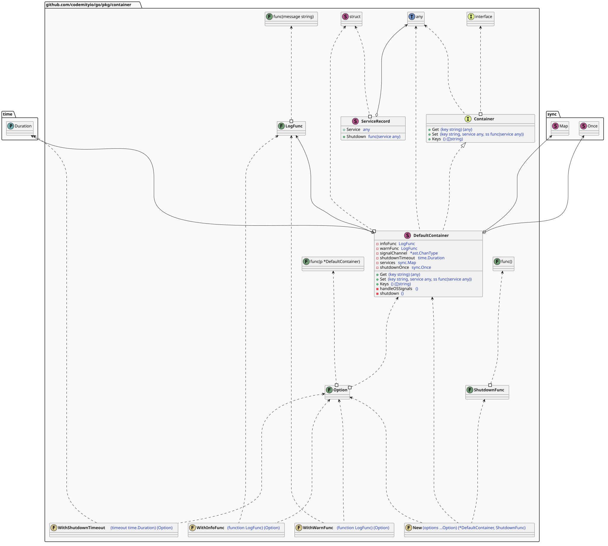
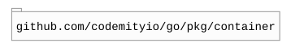

# `container`

## Table of contents

- [Summary](#summary)
- [Architecture](#architecture)
- [Dependencies](#dependencies)

## Summary

A simple service container.

## Architecture

## Dependencies

