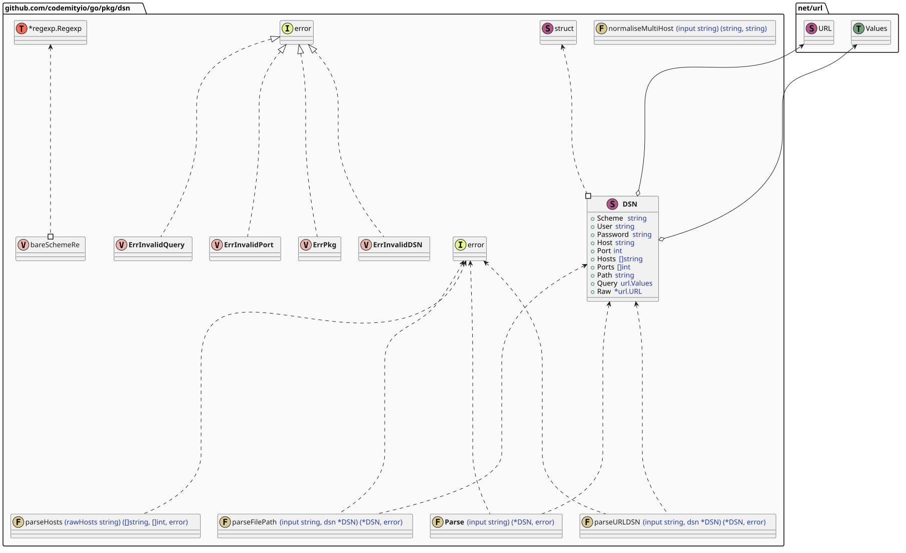
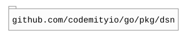

# `dsn`

## Table of contents

- [Summary](#summary)
- [Description](#description)
- [Architecture](#architecture)
- [Dependencies](#dependencies)

## Summary

A lightweight, scheme-aware parser that normalizes **DSN** strings from **URLs** and file paths into a structured form.

## Description

This package provides a robust, scheme-aware DSN (Data Source Name) parser capable of handling **URL**-based **DSNs** (
such as **MySQL**, **PostgreSQL**, **MongoDB**, and **SQLite**), filesystem paths (both relative and absolute), file
**URLs**, and bare schemes like memory or **SQLite**. It normalizes all inputs into a structured **DSN** type by
extracting the scheme, user credentials, host (including multi-host formats), port, path, query parameters, and optional
suffixes such as cache sizes. The parser automatically distinguishes between **URLs** and file paths, requires no
external dependencies, and offers a consistent, reliable way to interpret configuration strings across different storage
backends and connection formats.

## Architecture

## Dependencies

