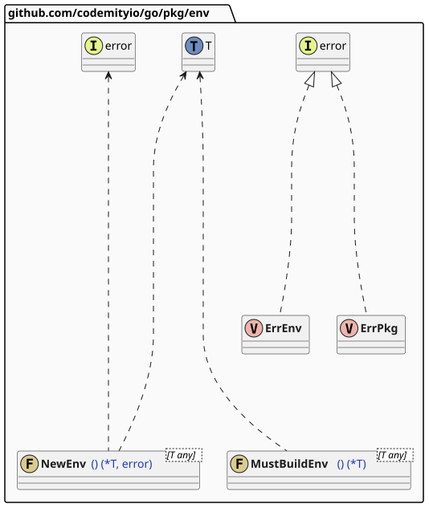
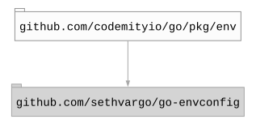

# `env`

## Table of contents

- [Summary](#summary)
- [Architecture](#architecture)
- [Dependencies](#dependencies)

## Summary

This package provides a generic, type-safe wrapper around [`go-envconfig`](https://github.com/sethvargo/go-envconfig)
for loading environment variables into strongly-typed Go structs. It exposes two factory functions: `NewEnv[T]()` for
error-handled config loading, and `MustBuildEnv[T]()` for startup-time initialization that panics on misconfiguration.

## Architecture

## Dependencies

