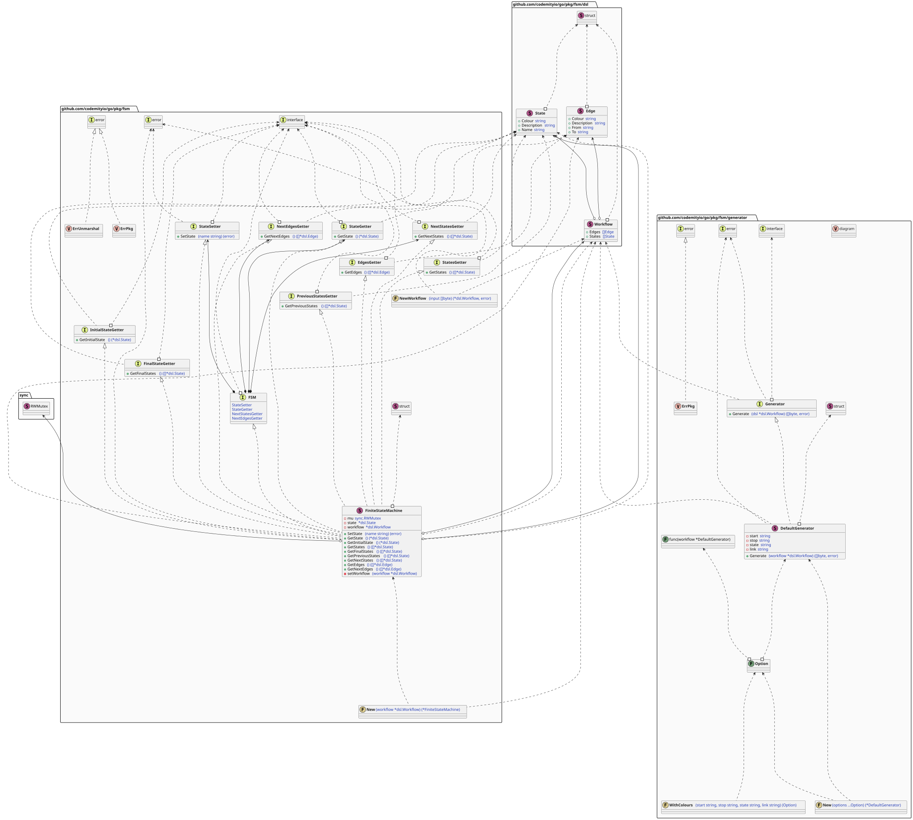
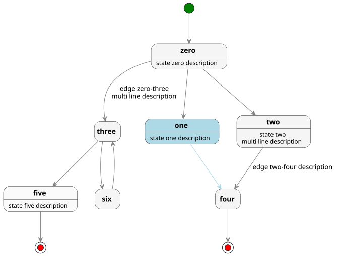
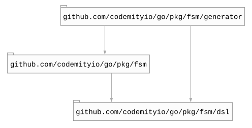

# `fsm`

## Table of contents

- [Summary](#summary)
- [How it works](#how-it-works)
- [Architecture](#architecture)
- [DSL](#dsl)
- [Generator](#generator)
  - [Example](#example)
- [Dependencies](#dependencies)

## Summary

This package contains a simple **Finite State Machine** package.

## How it works

- sets the initial workflow
- provides a current state
- provides the next allowed states
- sets a new state

## Architecture

## DSL

This package represents the workflow containing states and edges which also can be defined in a `json` file format.

## Generator

This package contains a generator capable of converting input **DSL** into a **PlantUML** file, which with additional
tool can be converted to an **SVG** file.

### Example

The following example has been generated from the dsl example located in [here](generator/testdata/workflow.json).

The result can be converted to an **SVG** diagram presented below.

## Dependencies

