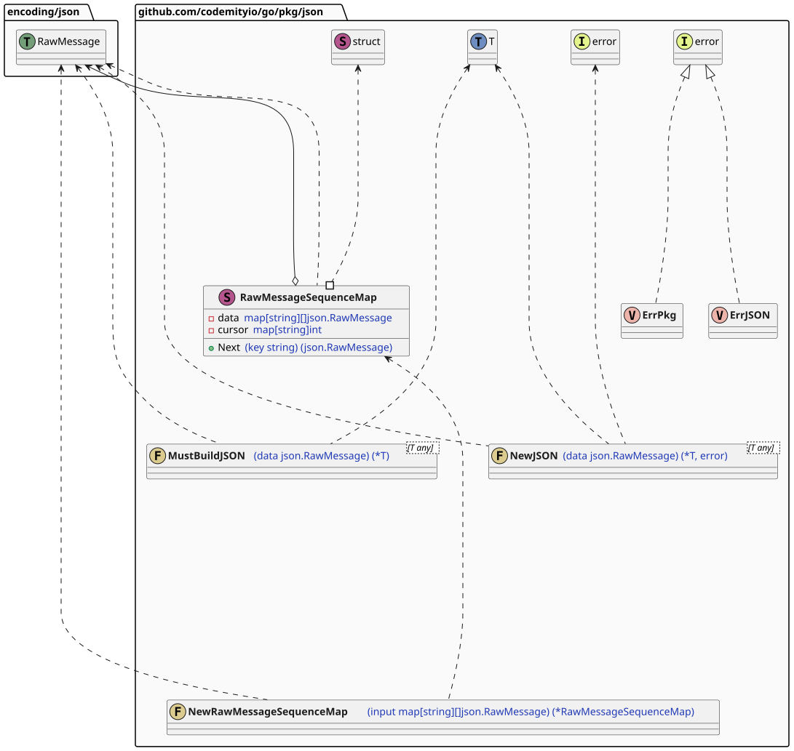
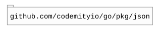

# `json`

## Table of contents

- [Summary](#summary)
- [Architecture](#architecture)
- [Dependencies](#dependencies)

## Summary

This package provides generic, type-safe utilities for unmarshalling raw JSON into typed Go structs, along with testing
helpers for managing deterministic sequences of JSON values and a simple serialiser with capability to serialise for
specific group of interest.

## Architecture

## Dependencies

