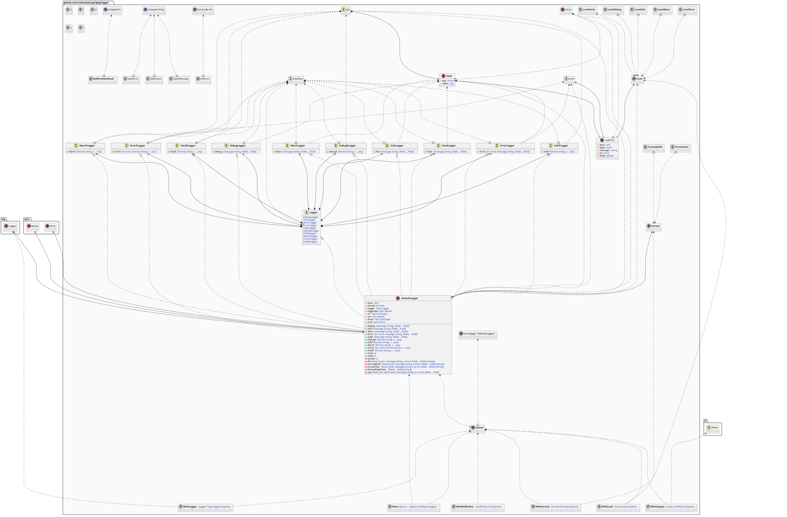
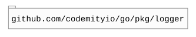

# `logger`

## Table of contents

- [Summary](#summary)
- [Architecture](#architecture)
- [Levels](#levels)
- [Formats](#formats)
- [Dependencies](#dependencies)

## Summary

This package provides a simple asynchronous logger that processes log entries through a buffered channel and a
background worker. It supports multiple log levels (`debug`, `info`, `warn`, `error`, `fatal`) and both `text` and
`json` output formats, with structured fields for contextual metadata.

## Architecture



## Levels

``` go
// LevelDebug a debug level for the logger.
LevelDebug Level = "debug"
// LevelInfo an info level for the logger.
LevelInfo Level = "info"
// LevelWarn warning level for the logger.
LevelWarn Level = "warning"
// LevelError an error level for the logger.
LevelError Level = "error"
// LevelFatal an fatal level for the logger.
LevelFatal Level = "fatal"
```

## Formats

``` go
// FormatText a simple text format for the log output.
FormatText Format = "text"
// FormatJSON a JSON format for the log output.
FormatJSON Format = "json"
```

## Dependencies


