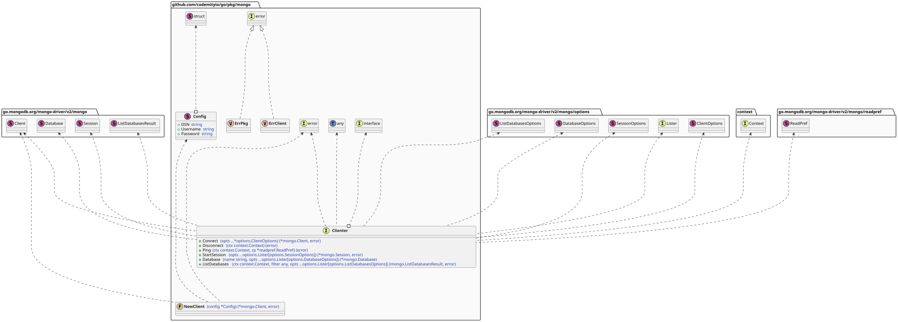
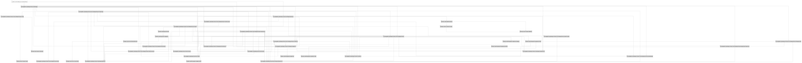

# `mongo`

## Table of contents

- [Summary](#summary)
- [Architecture](#architecture)
- [Dependencies](#dependencies)

## Summary

Package mongo provides a mongo client factory and abstractions for interacting with mongo. It wraps the official mongo
Go driver, exposing a simplified interface for connection management and database operations.

## Architecture

## Dependencies

