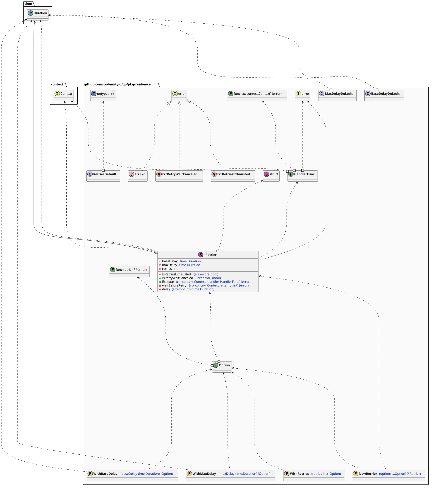
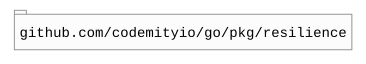

# `resilience`

## Table of contents

- [Summary](#summary)
- [Architecture](#architecture)
- [Dependencies](#dependencies)

## Summary

This package provides resilience patterns for executing operations under transient failure conditions.

## Architecture

## Dependencies

