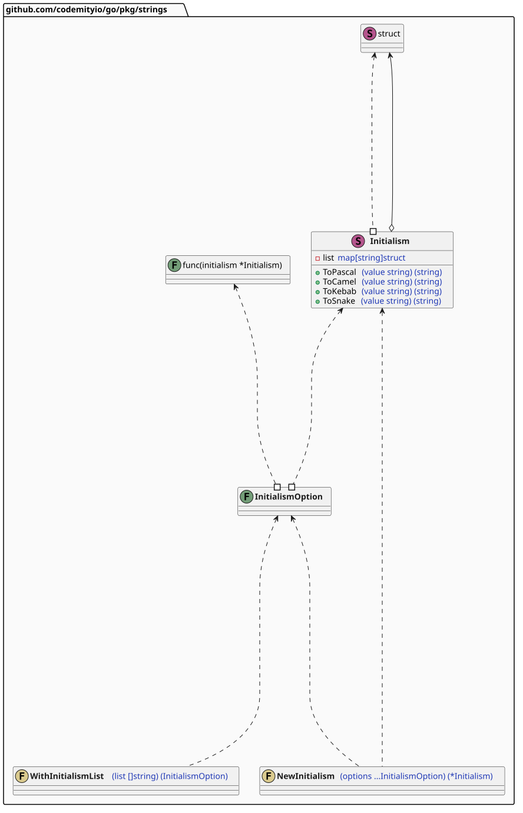
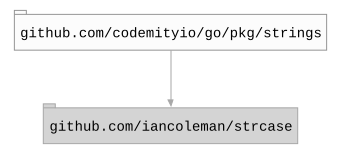

# `strings`

## Table of contents

- [Summary](#summary)
- [Architecture](#architecture)
- [Dependencies](#dependencies)

## Summary

This package provides string manipulation utilities.

## Architecture

## Dependencies

