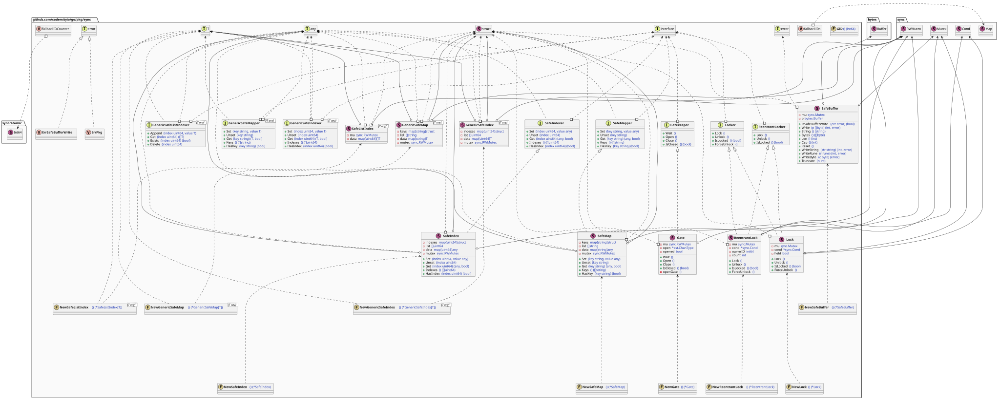
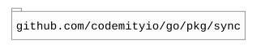

# `sync`

## Table of contents

- [Summary](#summary)
- [Architecture](#architecture)
- [Dependencies](#dependencies)

## Summary

This package provides concurrency primitives and thread-safe data structures to complement the Go standard library.

## Architecture

## Dependencies

