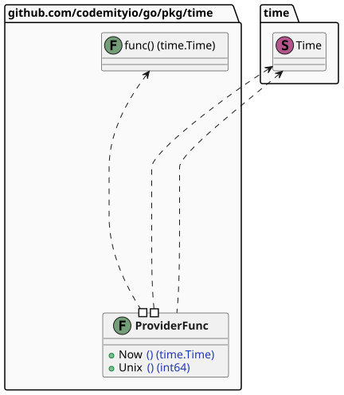
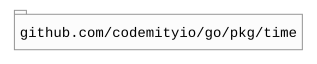

# `time`

## Table of contents

- [Summary](#summary)
- [Architecture](#architecture)
- [Dependencies](#dependencies)

## Summary

This package provides time utilities, currently offering a replaceable time provider to simplify time-dependent logic in
tests.

## Architecture

## Dependencies

