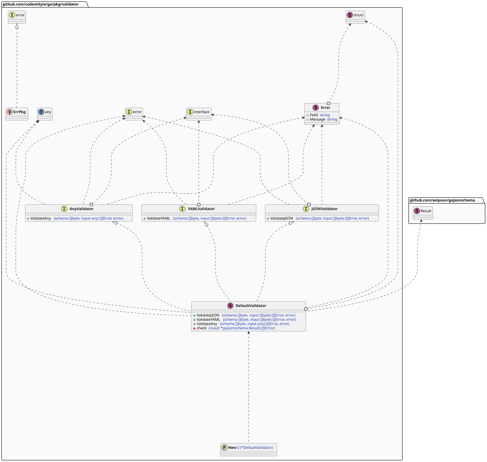
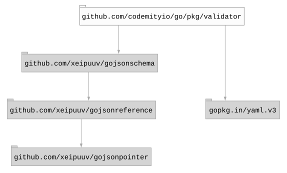

# `validator`

## Table of contents

- [Summary](#summary)
- [Input types](#input-types)
- [Design](#design)
- [Dependencies](#dependencies)

## Summary

This package provides JSON schema-based validation for **JSON**, **YAML**, and arbitrary Go values.

## Input types

The following input types are supported.

- `[]byte` - as **JSON**
- `[]byte` - as **YAML**
- `any`

## Design

## Dependencies

